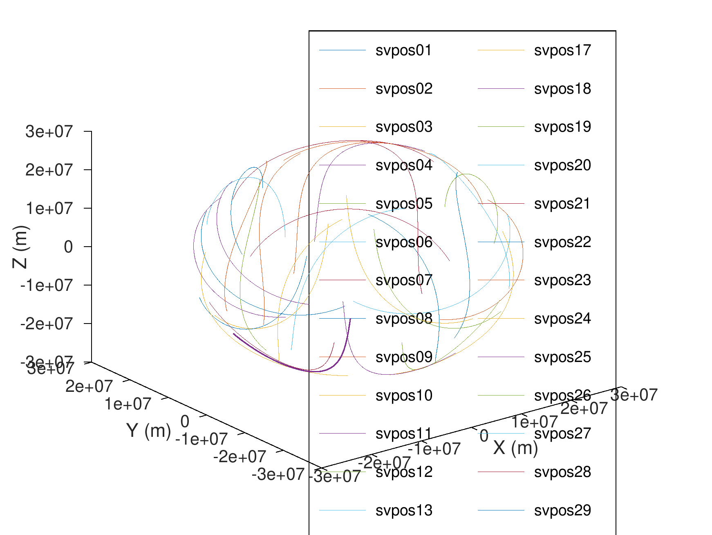

# RINEX Position Processing

A toolkit for processing RINEX (Receiver Independent Exchange Format) GPS navigation and observation files to extract satellite positions and generate 3D orbital visualizations.

This project reads RINEX navigation files (`.n` files) containing GPS satellite ephemeris data.

**Tech stacks:**


## Local Setup

### Python

1. Install Anaconda on your PC
2. Create the environment:
   ```bash
   conda env create -f environment.yml
   ```
3. Run the script:
   ```bash
   conda activate rinex
   python3 python/readnav.py
   ```

### MATLAB/Octave

1. Install Octave on your system:
   ```bash
   apt-get update -y --no-install-recommends
   apt-get install -y --no-install-recommends \
       octave \
       octave-netcdf \
       libnetcdf-dev
   ```
2. Run the script:
   ```bash
   octave --eval "rinexnav_enhanced"
   ```

## Docker Setup

### Quick Start

Build and run the container:

```bash
docker-compose up --build
```

Execute Octave/MATLAB code:
```bash
docker-compose exec rinexpos bash -c "cd matlab && octave rinexnav_enhanced.m"
```

Execute Python code:
```bash
docker-compose exec rinexpos python3 python/readnav.py
```

## Sample Results



*3D visualization of GPS satellite orbits showing the complex trajectories of 29 satellites over time, with each satellite represented by a unique colored line.*
