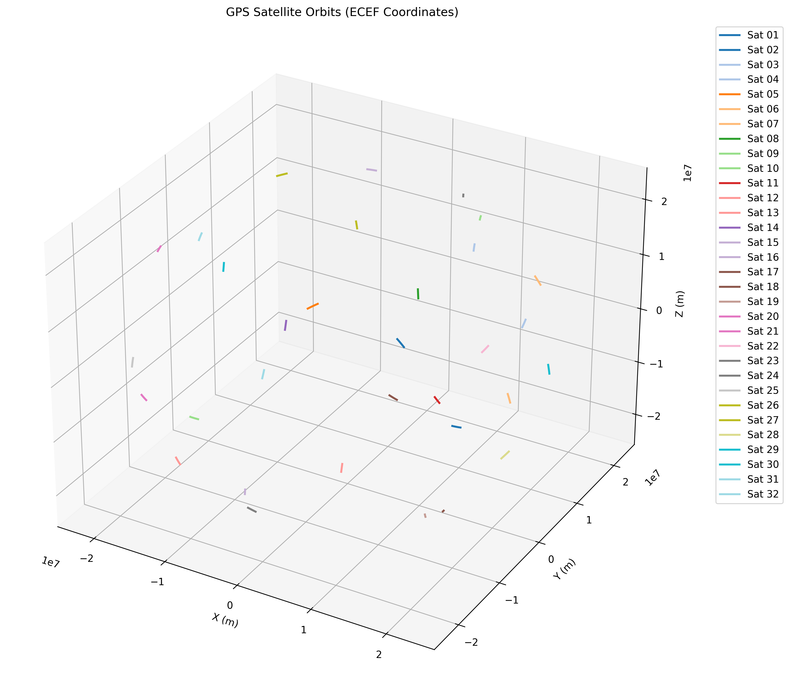
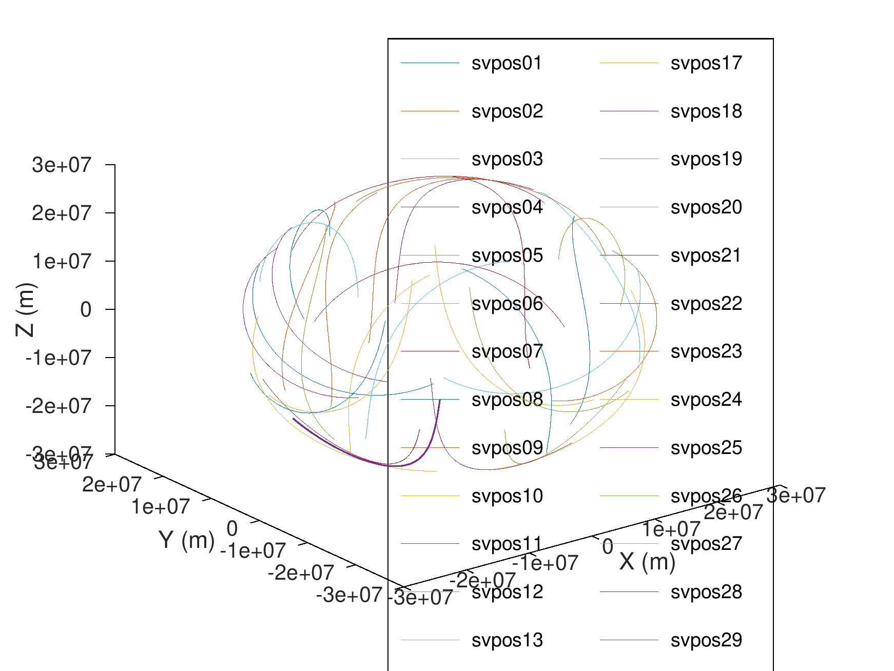

# RINEX Position Processing

A toolkit for processing RINEX (Receiver Independent Exchange Format) GPS navigation and observation files to extract satellite positions and generate 3D orbital visualizations.

This project reads RINEX navigation files (`.n` files) containing GPS satellite ephemeris data.

**Tech stacks:**


## Sample Results

*3D visualization of GPS satellite orbits showing the complex trajectories of satellites over time, with each satellite represented by a unique colored line. Both are showing the first 1000 epoch from the derieved data*

### Python




### MATLAB



## Local Setup

### Python

This project targets **Python 3.10**. Use 3.10 for prebuilt wheels (e.g. `netcdf4`) and to match CI/Docker.

#### Using uv

Install Astral UV from [here](https://docs.astral.sh/uv/getting-started/installation/)

Create a virtual environment and install dependencies:
```bash
uv python install 3.10
uv venv --python 3.10
source .venv/bin/activate
uv pip install -r requirements.txt
```

#### Using Anaconda

Install Anaconda from [here](https://www.anaconda.com/download)

Create the environment and install dependencies:
```bash
conda create -n rinex python=3.10
conda activate rinex
pip install -r requirements.txt
```

### MATLAB/Octave

Install Octave and required dependencies (see [Dockerfile](Dockerfile) for full list)

Run the script:
```bash
cd matlab
octave rinexnav_enhanced.m
```

## Docker Setup

### Quick Start

**Run Python processing:**
```bash
docker-compose run --rm rinexpos \
  python3 python/rinexnav.py \
  --file=data/chur1610.19n --interval=15 --plot
```

**Run Octave/MATLAB code:**
```bash
docker-compose run --rm rinexpos \
  bash -c "cd matlab && octave rinexnav_enhanced.m"
```

**Run with explicit date:**
```bash
docker-compose run --rm rinexpos \
  python3 python/rinexnav.py \
  --file=data/brdc0680.20n --date=20,3,8 --interval=100 --plot
```

**For debugging (interactive container):**
```bash
docker-compose up --build
# Then in another terminal:
docker-compose exec rinexpos bash
```

**Plot existing CSV data:**
```bash
docker-compose run --rm rinexpos \
  python3 python/plot_satellites.py \
  results/chur1610_python.csv --max_epochs=1000
```

**Create animation:**
```bash
docker-compose run --rm rinexpos \
  python3 python/plot_satellites.py \
  results/chur1610_python.csv --animation --max_epochs=1000
```

### Manual Image Building and Push

**Build and push:**
```bash
# Login
echo $GITHUB_TOKEN | docker login --username suizer98

# Build, tag, and push
docker-compose build
docker tag rinexpos suizer98/rinexpos:latest
docker tag rinexpos-test suizer98/rinexpos-test:latest
docker push suizer98/rinexpos:latest
docker push suizer98/rinexpos-test:latest
```

## Testing

Run whole test suite:

```bash
docker-compose --profile test up --build test
docker-compose --profile test run test
```

See [PythonTestKit](https://github.com/Suizer98/PythonTestKit) for more details.
