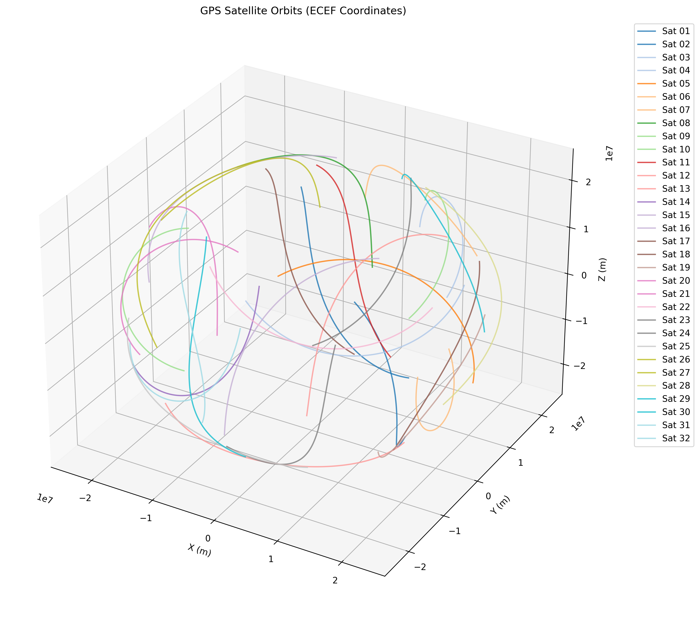

# RINEX Position Processing

A toolkit for processing RINEX (Receiver Independent Exchange Format) GPS navigation and observation files to extract satellite positions and generate 3D orbital visualizations.

This project reads RINEX navigation files (`.n` files) containing GPS satellite ephemeris data.

**Tech stacks:**


## Local Setup

### Python

1. Install Anaconda on your PC
2. Create the environment and install dependencies:
   ```bash
   conda create -n rinex python=3.10
   conda activate rinex
   pip install -r requirements.txt
   ```
3. Run the script:
   ```bash
   conda activate rinex
   python3 python/rinexnav.py --file=data/chur1610.19n --interval=15 --plot
   ```

### MATLAB/Octave

1. Install Octave and dependencies on your system (Linux or WSL2):
   ```bash
   sudo apt-get update -y --no-install-recommends
   sudo apt-get install -y --no-install-recommends \
       octave \
       octave-netcdf \
       libnetcdf-dev \
       gnuplot \
       ghostscript \
       libcairo2-dev \
       libpango1.0-dev
   ```
2. Run the script:
   ```bash
   cd matlab
   octave rinexnav_enhanced.m
   ```

## Docker Setup

### Quick Start

**Run Python processing:**
```bash
docker-compose run --rm rinexpos python3 python/rinexnav.py --file=data/chur1610.19n --interval=15 --plot
```

**Run Octave/MATLAB code:**
```bash
docker-compose run --rm rinexpos bash -c "cd matlab && octave rinexnav_enhanced.m"
```

**Run with explicit date:**
```bash
docker-compose run --rm rinexpos python3 python/rinexnav.py --file=data/brdc0680.20n --date=20,3,8 --interval=100 --plot
```

**For debugging (interactive container):**
```bash
docker-compose up --build
# Then in another terminal:
docker-compose exec rinexpos bash
```

**Plot existing CSV data:**
```bash
docker-compose run --rm rinexpos python3 python/plot_satellites.py results/chur1610_python.csv --max_epochs=1000
```

## Sample Results

*3D visualization of GPS satellite orbits showing the complex trajectories of satellites over time, with each satellite represented by a unique colored line. Both are showing the first 1000 epoch from the derieved data*

### MATLAB


### Python



## Testing

Run linting and unit tests:

```bash
# Run all checks (linting + tests)
docker-compose --profile test up --build test
docker-compose --profile test run test

# Run individual tools
docker-compose run --rm test black python/     # Format code
docker-compose run --rm test ruff check python/  # Lint code
docker-compose run --rm test pytest tests/     # Run tests

# Run with Semgrep (optional)
export SEMGREP_APP_TOKEN=your_token_here
docker-compose up test
```